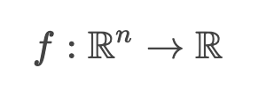

<!DOCTYPE html>
<!-- KaTeX requires the use of the HTML5 doctype. Without it, KaTeX may not render properly -->
<html>
  <head>
    <link rel="stylesheet" href="https://cdn.jsdelivr.net/npm/katex@0.12.0/dist/katex.min.css" integrity="sha384-AfEj0r4/OFrOo5t7NnNe46zW/tFgW6x/bCJG8FqQCEo3+Aro6EYUG4+cU+KJWu/X" crossorigin="anonymous">

    <!-- The loading of KaTeX is deferred to speed up page rendering -->
    

    <!-- To automatically render math in text elements, include the auto-render extension: -->
    
  </head>
  ...
</html>

## Day 1

Name the following machine learning task:

*"...the computer program is aksed to predict a numerical value given some input. To solve this task, the learning algorithm is asked output a function"*

- A) Classification
- B) Regression
- C) Structured output

Answer: <input type="text" placeholder="Type your answer" id="day1_choice" name="day1_choice"/>
<button type="submit" id="day1_submit" class="button">Send</button> 

